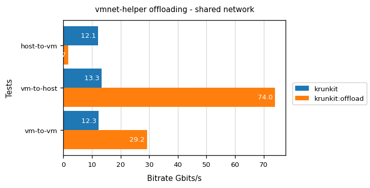
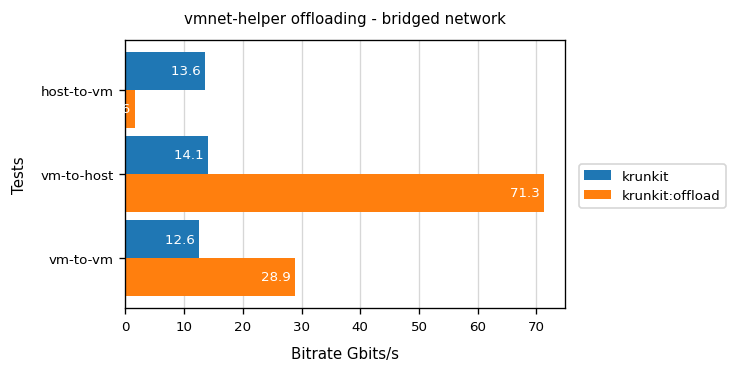

<!--
SPDX-FileCopyrightText: The vmnet-helper authors
SPDX-License-Identifier: Apache-2.0
-->

# vmnet-helper

A high-performance network proxy connecting virtual machines to the
macOS vmnet network without running the VM process as root or requiring
the `com.apple.vm.networking` entitlement.

On macOS 15 and earlier, the helper requires root only to start the
vmnet interface, then immediately drops privileges and runs as the
unprivileged user.

> [!NOTE]
> On macOS 26 and later, the helper does not require root privileges.

<!-- IMPORTANT: Do not change this heading - external links depend on it -->
## Installation

### macOS 26 and later

Install using [Homebrew](https://brew.sh/):

```console
brew tap nirs/vmnet-helper
brew install vmnet-helper
```

### macOS 15 and earlier

To install the latest version run:

```console
curl -fsSL https://github.com/nirs/vmnet-helper/releases/latest/download/install.sh | bash
```

You can download the install script for inspection and run it locally.

The install script downloads the latest release and installs it at
`/opt/vmnet-helper`, and configures a sudoers rule to allow running
vmnet-helper without a password. See [sudoers.d](sudoers.d) for more info.

> [!NOTE]
> Homebrew installation is not available for macOS 15 and earlier because
> vmnet-helper requires root privileges. Installing via Homebrew would allow
> malware to replace the executable and gain root access.

## Starting the interface by passing a file descriptor

> [!NOTE]
> This is the most secure way, connecting the vmnet helper and the
> virtual machine process using a socketpair.

The program running vmnet-helper and the virtual machine process (vfkit,
qemu) creates a datagram socketpair. One file descriptor must be passed
to vmnet-helper child process using the `--fd` option, and the other to
the virtual machine child process.

After creating the network interface, the helper writes a single line
JSON message describing the interface to stdout. The program running the
helper can parse the JSON message and extract the mac address for the
virtual machine.

Example run using jq to pretty print the response:

```console
% sudo --non-interactive \
       --close-from 4 \
       /opt/vmnet-helper/bin/vmnet-helper \
       --fd 3 \
       --interface-id 2835E074-9892-4A79-AFFB-7E41D2605678 \
       2>/dev/null | jq
{
  "vmnet_subnet_mask": "255.255.255.0",
  "vmnet_mtu": 1500,
  "vmnet_end_address": "192.168.105.254",
  "vmnet_start_address": "192.168.105.1",
  "vmnet_interface_id": "2835E074-9892-4A79-AFFB-7E41D2605678",
  "vmnet_max_packet_size": 1514,
  "vmnet_nat66_prefix": "fd9b:5a14:ba57:e3d3::",
  "vmnet_mac_address": "0a:d6:36:c1:ea:f3"
}
```

> [!TIP]
> vmnet documentation instructs to configure the virtual interface with
> the mac address specified by "vmnet_mac_address". Testing shows that
> this is not required and any mac address works.

The interface-id option is optional. It ensures that you get the same
MAC address on the every run.

## Starting the helper with a unix socket

To start the helper from a shell, or if the virtual machine driver does not
support passing a file descriptor, you can use a bound unix socket.

Example run with a unix socket, redirecting the helper stdout to file:

```console
% sudo --non-interactive \
       /opt/vmnet-helper/bin/vmnet-helper \
       --socket /tmp/example/vm/vmnet.sock \
       --interface-id 2835E074-9892-4A79-AFFB-7E41D2605678 \
       >/tmp/example/vm/vmnet.json
INFO  [main] running /opt/vmnet-helper/bin/vmnet-helper v0.2.0-4-ga1b610b on macOS 15.2.0
INFO  [main] enabling bulk forwarding
INFO  [main] started vmnet interface
INFO  [main] running as uid: 501 gid: 20
INFO  [main] waiting for client on "/tmp/example/vm/vmnet.sock"
```

The helper created a unix datagram socket and waits until a client
connects and send the first packet.

You can get the mac address for the vm from the vmnet.json:

```console
jq -r .vmnet_mac_address </tmp/example/vm/vmnet.json
```

### Connecting to the helper unix socket

To connect to the helper from a client, you need to:

1. Create a unix datagram socket
1. Bind the socket to allow the helper to send packets to your socket
1. Connect the socket the helper socket

> [!TIP]
> In Go the last 2 steps can be done using:
> `net.DialUnix("unixgram", clientAddress, serverAddress)`

When your client sends the first packet, the helper will start serving:

```console
INFO  [main] serving client "/tmp/example/vm/vfkit-1262-6e38.sock"
INFO  [main] host forwarding started
INFO  [main] vm forwarding started
INFO  [main] waiting for termination
```

> [!NOTE]
> Once connected, the helper will ignore packets sent by a new client.
> If you want to recover from failures, restart the helper to create a
> new unix socket and reconnect.

### Using vmnet-client

To use the helper from a shell script without using a bound unix socket, you
can use *vmnet-client*. The client creates a socketpair, and starts the helper
with one socket, and the command provided by the user with the other socket.

Example run with *vfkit*:

```console
/opt/vmnet-helper/bin/vmnet-client -- \
    vfkit \
    --bootloader=efi,variable-store=efi-variable-store,create \
    "--device=virtio-blk,path=disk.img" \
    "--device=virtio-net,fd=4,mac=92:c9:52:b7:6c:08" \
```

> [!IMPORTANT]
> The command run by *vmnet-client* must use file descriptor 4.

See the [examples](examples/) for more examples for using *vmnet-client*.

> [!TIP]
> On macOS 26 and later, use the `--unprivileged` option to run the
> helper without sudo.

## Operation modes

The vmnet helper supports all the operation modes provided by the vmnet
framework, using the **--operation-mode** option.

### --operation-mode=host

Allows the vmnet interface to communicate with other vmnet interfaces
that are in host mode and also with the native host.

Options:

- **--enable-isolation**: Enable isolation for this interface. Interface
  isolation ensures that network communication between multiple vmnet
  interface instances is not possible.

### --operation-mode=shared

Allows traffic originating from the vmnet interface to reach the
Internet through a network address translator (NAT). The vmnet interface
can also communicate with the native host. By default, the vmnet
interface is able to communicate with other shared mode interfaces.

Options:

- **--start-address**: The starting IPv4 address to use for the interface.
  This address is used as the gateway address. The subsequent address up
  to and including **--end-address** are placed in the DHCP pool.
  All other addresses are available for static assignment.  The address
  must be in the private IP range (RFC 1918).  Must be specified along
  with **--end-address** and **--subnet-mask** (default "192.168.105.1").

- **--end-address**: The DHCP IPv4 range end address (string) to use for
  the interface.  The address must be in the private IP range (RFC
  1918).  Must be specified with **--start-address** and
  **--subnet-mask** (default "192.168.105.254").

- **--subnet-mask**: The IPv4 subnet mask to use on the interface.  Must
  also specify **--start-address** and **--end-address** (default
  "255.255.255.0").

### --operation-mode=bridged

Bridges the vmnet interface with a physical network interface. When
using this mode you must specify the interface name using
**--shared-interface**.

Required options:
- **--shared-interface**: The name of the interface to use.

You can find the physical interfaces that can be used in bridged more
using the **--list-shared-interfaces** option.

```console
% /opt/vmnet-helper/bin/vmnet-helper --list-shared-interfaces
en10
en0
```

## Offloading options

These options can be used with krunkit to get much better performance in some
cases and much worse performance in other cases. See the
[Offloading](#offloading) section for performance results.

- **--enable-tso**: Enable TCP segmentation offload. Note, when this is enabled,
  the interface may generate large (64K) TCP frames. It must also be prepared to
  accept large TCP frames as well.

- **-enable-checksum-offload**: Enable checksum offload for this interface. The
  checksums that are offloaded are: IPv4 header checksum, UDP checksum (IPv4 and
  IPv6), and TCP checksum (IPv4 and IPv6).

  In order to perform the offload function, all packets flowing in and out of
  the vmnet_interface instance are verified to pass basic IPv4, IPv6, UDP, and
  TCP sanity checks. A packet that fails any of these checks is simply dropped.

  On output, checksums are automatically computed as necessary on each packet
  sent using vmnet_write().

  On input, checksums are verified as necessary. If any checksum verification
  fails, the packet is dropped and not delivered to vmnet_read().

  Note that the checksum offload function for UDP and TCP checksums is unable to
  deal with fragmented IPv4/IPv6 packets. The VM client networking stack must
  handle UDP and TCP checksums on fragmented packets itself.

> [!IMPORTANT]
> You must use both **--enable-tso** and **--enable-checksum-offload** when
> using krunkit **offloading=on** virtio-net option.

## Stopping the interface

Terminate the vmnet-helper process gracefully. Send a SIGTERM or SIGINT
signal and wait until child process terminates.

## Logging

The vmnet helper logs to stderr. You can read the logs and integrate
them in your application logs or redirect them to a file.

## Examples

The example tool shows how to integrate vmnet-helper with *vfkit* or
*qemu*.

To install the requirements for creating virtual machine using *vfkit*
*krunkit*, and *qemu* run:

```console
brew tap slp/krunkit
brew install python3 vfkit krunkit qemu cdrtools
python3 -m venv .venv
source .venv/bin/activate
pip install pyyaml
```

To start a virtual machine using *vfkit* run:

```console
% ./example vm
Starting vmnet-helper for 'vm' with interface id '391ea262-d812-45b9-9526-e0ab5aeff7a2'
Downloading image 'https://cloud-images.ubuntu.com/releases/24.10/release/ubuntu-24.10-server-cloudimg-arm64.img'
Converting image to raw format '/Users/nir/.vmnet-helper/cache/images/fe0930aca80e74ef9bcdc6e883fd6d716f490f765c8848d90f1d9c9cf69c43b2/disk.img'
Resizing image to 20g
Creating disk '/Users/nir/.vmnet-helper/vms/vm/disk.img'
Creating cloud-init iso '/Users/nir/.vmnet-helper/vms/vm/cidata.iso'
Starting 'vfkit' virtual machine 'vm' with mac address 'a2:89:b2:31:d7:fb'
Virtual machine IP address:  192.168.105.2
```

To stop the virtual machine and the vmnet-helper press *Control+C*.

### SSH configuration

To configure ssh for the test vms add this to your `.ssh/config`:

```
Include ~/.vmnet-helper/vms/*/ssh.config
```

With this configuration you can login to the example vm with:

```console
ssh vm
```

## Performance

We benchmarked vmnet-helper with 3 VMs types (vfkit, krunkit, qemu) in
all operation modes supported by the vmnet framework (shared, bridged,
host), in 3 directions (host to vm, vm to host, vm to vm), on 2 machines
(iMac M3, MacBook Pro M2 Max) running macOS 15.6.1.

See the [performance](/performance) directory for full test results.

### Comparing to socket_vmnet

Comparing to [socket_vmnet](https://github.com/lima-vm/socket_vmnet)
with [lima](https://github.com/lima-vm/lima) using VZ and qemu vm types,
vmnet-helper with [vfkit](https://github.com/crc-org/vfkit) is up to *10
times faster*, and vmnet-helper with [qemu](https://www.qemu.org/) is up
to *3 times faster*.


### Comparing different VMs

Performance depends on VM type and transfer direction.
[vfkit](https://github.com/crc-org/vfkit) performs better in all tests.
[qemu](https://www.qemu.org/) is up to *5 times slower* than vfkit.


### Offloading

With krunkit we can the vmnet framework offloading options to dramatically
increase performance for vm-to-host and vm-to-vm cases. However using offloading
also dramatically reduces performance in host-to-vm case. If you have a workload
that use mostly vm to vm traffic you may benefit from offloading.




## Performance testing

To install the requirements for running benchmarks and generating plots
run:

```console
source .venv/bin/activate
pip install matplotlib
```

### Running benchmarks

Create vms for benchmarking:

```
./bench create
```

To run all benchmarks with all drivers and all operation modes and store
iperf3 results in json format use:

```
./bench run benchmarks/full.yaml
```

The benchmark results are stored under `out/bench/vmnet-helper`.

See the [benchmarks](/benchmarks) directory for additional configurations.

When done you can delete the vms using:

```
./bench delete
```

### Creating plots

To create plots from benchmark results run:

```
./bench plot -o out plots/drivers.yaml
```

The plots use the results stored under `out/bench` and created under
`out/plot`.

See the [plots](/plots) directory for additional configurations.

### socket_vmnet

Running socket_vmnet as launchd service, creating virtual machines with
lima 1.0.6.

Tests run using socket_vmnet `test/perf.sh` script:

```console
test/perf.sh create
test/perf.sh run
```

To include socket_vmnet results in the plots copy the test results to
the output directory:

```
cp ~/src/socket_vmnet/test/perf.out/socket_vmnet out/bench/
```

## Similar tools

### socket_vmnet

[socket_vmnet](https://github.com/lima-vm/socket_vmnet) has the same
purpose and features, providing access to vmnet capabilities without the
special `com.apple.vm.networking` entitlement.

The main difference between vmnet-helper and socket_vmnet is using a
helper process and vmnet interface per vm, instead of single daemon
process and vmnet interface for vms using the same networking mode
(host, bridged). Using a separate process is simpler to manage, more
reliable, and more secure.

The second difference is using a unix datagram socket instead of a unix
stream socket and qemu length prefixed packets format. This is simpler
and performs better, avoiding copying and converting packets from qemu
format to raw format.

Detailed list of differences:

- Much better performance when using Apple Virtualization framework (see
  [performance](#performance) section).
- Eliminating the scaling issues caused by flooding packets to vms by
  using one vmnet interface per VM, and delegating to vmnet for forwarding
  packets to the right mac address. For more info see
  https://github.com/lima-vm/socket_vmnet/issues/58.
- Eliminating copying packets from length prefixed qemu packets on unix
  stream socket to vz datagram socket by copying directly from vmnet to
  vz file handle unix datagram socket.
- Using sendmsg_x() and recvmsg_x() for reading and writing multiple
  packets per one syscall doubles throughput in vm to vm use case and
  lower cpu usage.
- More reliable: crash in one helper process affects only one virtual
  machine.
- More secure: dropping privileges after starting the vmnet interface
  and running as the real user and group id.
- Eliminating the need to managed daemons and sockets files shared by
  multiple virtual machines.
- Works with [vfkit](https://github.com/crc-org/vfkit) using
  `--device=virtio-net,fd=` device.
- Works with [qemu](https://www.qemu.org/) using `-netdev dgram` device
  instead of `-netdev unix` device.
- Not integrated yet with [lima](https://github.com/lima-vm/lima) or
  [minikube](https://minikube.sigs.k8s.io/).

### softnet

[softnet](https://github.com/cirruslabs/softnet) seems to provide the
same vmnet network features, using the same process model - one helper
process and vmnet interface per virtual machine.

softnet support network isolation and tweaking DHCP server lease
timeout, which are not in scope for vmnet-helper.

sofntnet is released under AGPL license which may be harder to adopt in
your organization.

## Development

To set up the development environment:

```console
python3 -m venv .venv
source .venv/bin/activate
pip install pytest scapy pyyaml black
```

To run the tests:

```console
pytest -v
```

To format Python code:

```console
./fmt.sh
```

## Documentation

- [Architecture](docs/architecture.md)
- [How to create a release](docs/release.md)

## License

vmnet-helper is under the [Apache 2.0 license](/LICENSES/Apache-2.0.txt)
