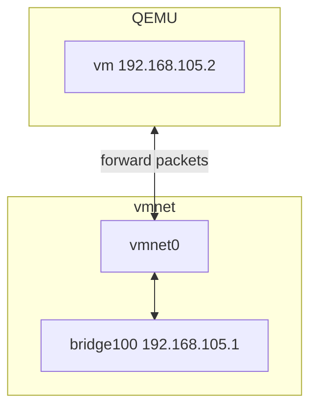
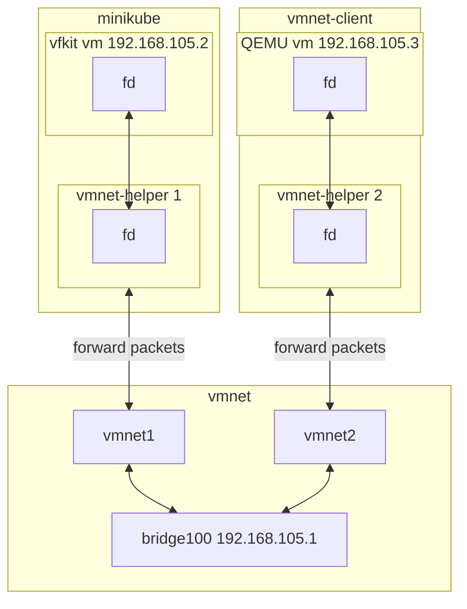
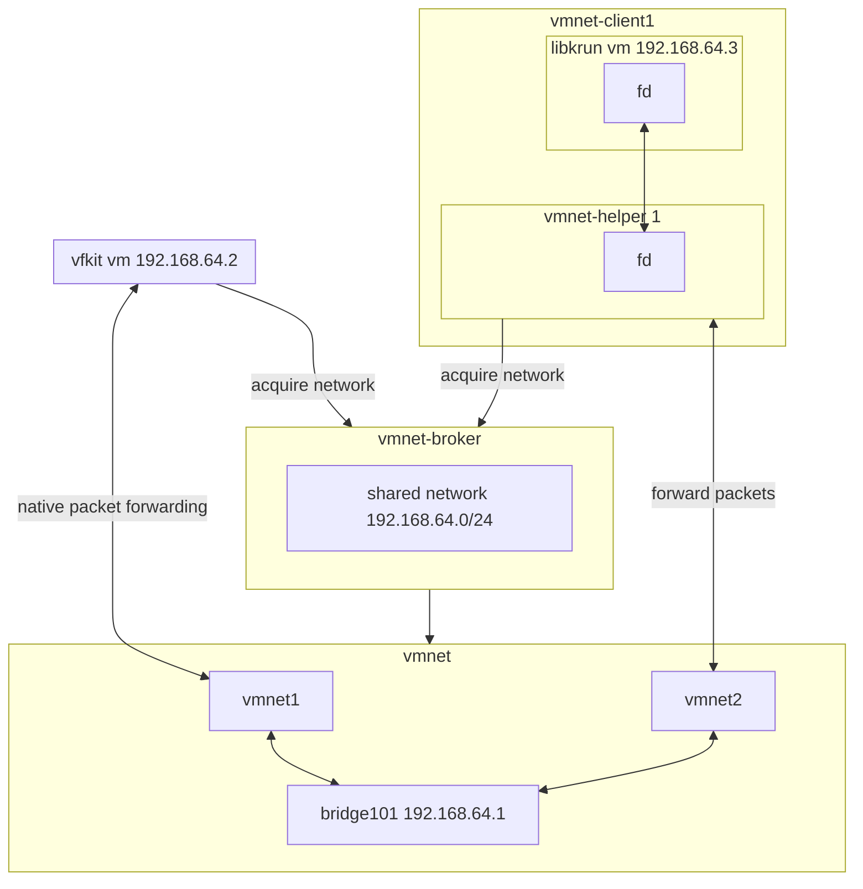

<!--
SPDX-FileCopyrightText: The vmnet-helper authors
SPDX-License-Identifier: Apache-2.0
-->

# Architecture

This document describes how vmnet-helper connects VMs to the macOS vmnet network
and how multiple VMs share the same network.

## What is vmnet?

[vmnet] is a macOS framework for virtual machine networking. When a
process creates a vmnet interface (e.g. vmnet0), macOS attaches it to a network
bridge (e.g. bridge100). The process can then read and write Ethernet frames
on the vmnet interface. The bridge forwards traffic between VMs on the same
network, the host, and the internet (via NAT in shared mode). The bridge is
created automatically when the first vmnet interface is created and removed
when the last interface is destroyed.

VM tools such as QEMU can use vmnet directly. For example, QEMU's
`-netdev vmnet-shared` mode creates the vmnet interface and copies packets
between the VM and vmnet internally.

## Why vmnet-helper?

Using vmnet requires either root privileges or the `com.apple.vm.networking`
entitlement. Apple grants this entitlement only to approved virtualization
products — not a model that works for open source projects. Running VM
processes as root is a security risk.

vmnet-helper provides the following services:

- **Privilege separation**: the VM process runs unprivileged. On macOS 15 and
  earlier, the helper starts as root to create the vmnet interface, then
  immediately drops privileges. On macOS 26 and later, root is not required at
  all.
- **vmnet access**: the helper creates the vmnet interface and forwards packets
  between the VM's file descriptor and vmnet. The application is not in the
  data path — it only configures the VM.
- **Efficient packet forwarding**: the helper uses optimized I/O to forward
  packets, so the application does not need to implement this.
- **Native vmnet integration**: on macOS 26 and later, vmnet-helper can join
  native vmnet networks via [vmnet-broker], letting VMs share the same network
  as VMs using the Virtualization framework. See
  [Native vmnet on macOS 26](#native-vmnet-on-macos-26) for details.

Without vmnet-helper, vfkit and libkrun cannot use the vmnet network at all.
For QEMU, vmnet-helper allows using vmnet without root.

vmnet-helper also provides up to an order of magnitude better performance
compared to existing tools like [socket_vmnet] or [gvproxy]. See the
[performance](../README.md#performance) section for detailed benchmarks.

## How it works

vmnet-helper is **per VM**: each VM has its own helper process that forwards
packets between the VM (via a socket or file descriptor) and a vmnet interface
on the host. vmnet-helper is not a switch; it is the "cable" between the VM
process and the vmnet network.

The program that starts vmnet-helper and the VM connects them using a pair of
unix datagram sockets. Some programs like [minikube] do this internally. For
programs that don't, **vmnet-client** is a small supervisor that starts
vmnet-helper and the VM, connects them using a socketpair, and terminates both
when the client exits.

- **minikube**: Starts vfkit and vmnet-helper internally, connecting them via a socketpair.
- **vmnet-client**: A small supervisor that starts QEMU and vmnet-helper, connecting them via a socketpair.
- **vmnet1, vmnet2**: vmnet interfaces (one per helper), attached to the bridge.
- **bridge100**: Host bridge for the subnet; typically has the subnet’s gateway IP (e.g. 192.168.105.1).

Use the same subnet options for all VMs that should be on the same network.
Use a stable `--interface-id` per VM so the MAC (and thus DHCP-assigned IP)
stays the same across restarts.

## Native vmnet on macOS 26

Starting with macOS 26, the Virtualization framework can use vmnet directly
without a helper process. This is based on a new concept: **virtual networks**.

A virtual network is a reservation — the process requests a subnet (e.g.
192.168.42.0/24) and macOS reserves it. The process then creates vmnet
interfaces on that network and uses them to create network devices for the VM.
The Virtualization framework handles the packet forwarding between the VM and
the vmnet interface natively — no application code needed, with 3–6x better
performance and lower CPU usage compared to copying packets in vmnet-helper.

The catch: the virtual network belongs to the process that created it. Other
processes cannot create vmnet interfaces on the same network. To put multiple
VMs on the same network, the creating process must share the virtual network
resource with other processes via XPC.

Apple's container project uses this approach: an XPC service creates the
network for each subnet, keeps it alive while containers use it, and shares it
with containers via XPC. But other VM tools cannot access Apple's XPC service.

**[vmnet-broker]** solves this. It is a shared XPC service that any VM tool can
use to create and share virtual networks. A VM tool requests a network by name
(e.g. "shared"); the broker creates it on first use and shares it with all
requesting processes. The broker keeps the network alive until the last VM
disconnects.

vmnet-helper can also obtain a network from vmnet-broker. Without vmnet-helper,
VMs using QEMU or libkrun cannot join a native vmnet network used by the
Virtualization framework. vmnet-helper bridges this gap, letting all VMs share
the same network regardless of their hypervisor.

- **vfkit vm**: VM using native vmnet; gets the network from vmnet-broker.
- **libkrun vm + vmnet-helper**: VM using vmnet-helper; helper gets the same network from vmnet-broker.
- **vmnet-broker**: Owns the shared network; must keep running while any VM uses it.
- **bridge101**: Bridge for the broker’s network (e.g. 192.168.64.0/24); vmnet interfaces from both native VMs and vmnet-helper attach here.

With vmnet-broker, the network lifetime is independent of any single VM or
helper; it lasts until the broker is stopped.

> [!NOTE]
> Native vmnet support in vfkit is not yet available. Currently, vmnet-helper
> is the only vmnet-broker client.

[gvproxy]: https://github.com/containers/gvisor-tap-vsock
[minikube]: https://minikube.sigs.k8s.io/
[socket_vmnet]: https://github.com/lima-vm/socket_vmnet
[vmnet]: https://developer.apple.com/documentation/vmnet
[vmnet-broker]: https://github.com/nirs/vmnet-broker
