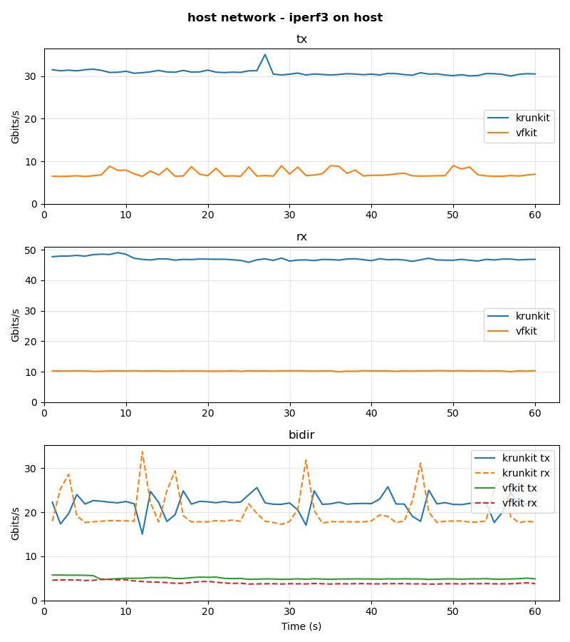
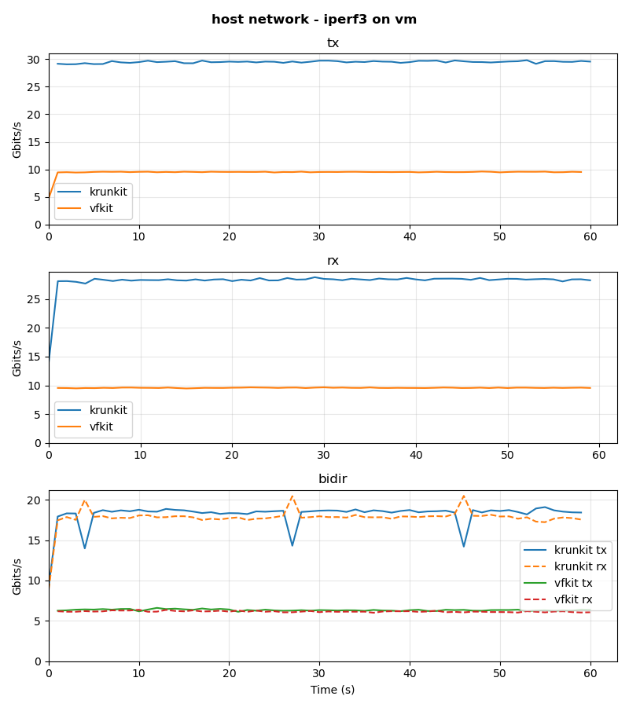
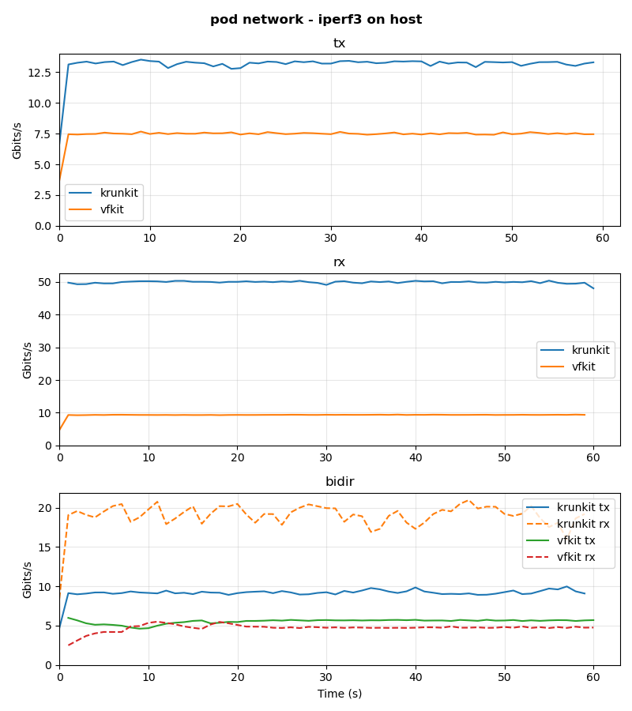
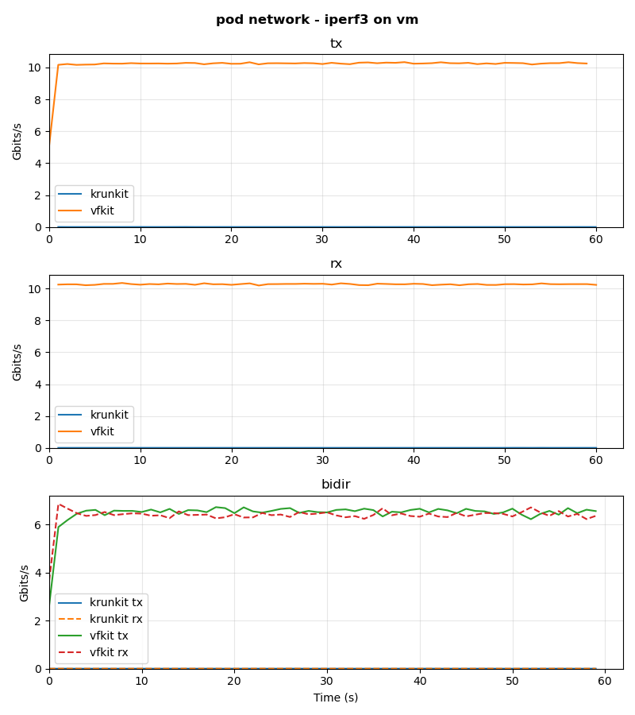

# Minikube Performance Test Results

## host network - iperf3 on host

Host network with iperf3 client running on the host. Measures network performance between the host and the VM using the host network (no pod network overhead).

## host network - iperf3 on vm

Host network with iperf3 client running inside the client VM. Measures VM-to-VM network performance using the host network.

## pod network - iperf3 on host

Pod network with iperf3 client running on the host. Measures network performance between the host and the VM through the Kubernetes pod network and NodePort service.

## pod network - iperf3 on vm

Pod network with iperf3 client running inside the client VM. Measures VM-to-VM network performance through the Kubernetes pod network and NodePort service.

